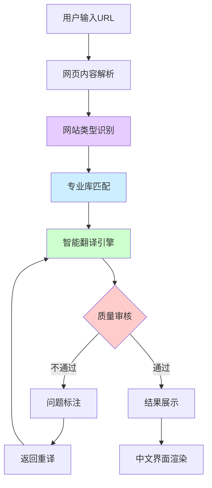

# 全球语言无障碍浏览系统 - 需求分析与技术方案

## 项目概述
一款智能网页翻译工具，帮助中文用户无障碍浏览全球网站，重点解决翻译质量与准确性问题。

## 系统流程图

## 核心功能模块

### 1. URL 输入与解析模块
- 用户输入目标网址
- 系统获取网页原始内容（HTML、文本、图片等）

### 2. 网站类型智能识别模块
#### 识别维度
- **DOM 结构分析**：HTML 标签分布、内容区域占比、链接密度
- **文本特征提取**：关键词频率、文本长度、标题层级
- **视觉特征**：布局模式、颜色主题、图片类型
- **元数据分析**：meta 标签、schema.org 数据、robots.txt
- **交互元素**：表单类型、按钮结构、动态内容

#### 分类策略
- 预训练模型 + 微调
- 规则引擎 + 机器学习
- 向量相似度匹配

### 3. 专业库匹配模块
- 根据网站类型调用对应的专业术语库
- MCP 工具集成
- 行业特定翻译规则

### 4. 智能翻译引擎模块
- 多模型融合翻译
- 上下文感知翻译
- 专业术语保护

### 5. 多重质量审核过滤器
#### 审核层次
1. 类型匹配度检查过滤器
2. 专业术语准确性验证过滤器
3. 整体翻译质量评分过滤器
4. 语义一致性检验过滤器

#### 审核结果处理
- 通过：进入下一环节
- 不通过：标注问题点，返回重译环节

### 6. 结果展示模块
- 中文界面展示
- 保留原网页结构
- 高亮显示翻译调整部分
- 用户反馈收集

## 技术架构初探

### 核心模块
1. URL 解析器
2. 网站类型识别器
3. 专业库匹配器
4. 翻译引擎集群
5. 质量审核器
6. 错误反馈器

## MVP 验证思路
- 最简化功能验证
- 核心流程可行性测试
- 用户需求确认

## 待讨论问题
- 翻译质量评估标准制定
- 专业领域知识库构建方式
- 多重审核效率优化
- 用户体验设计